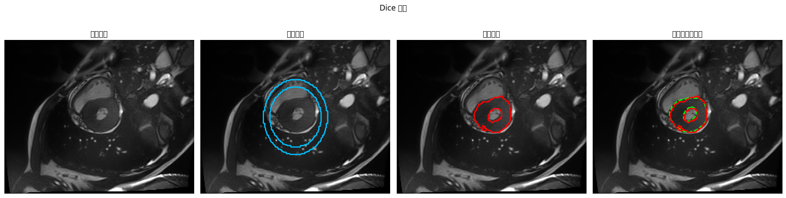
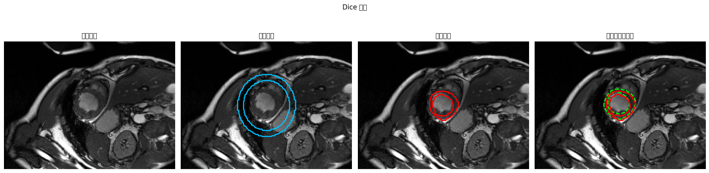
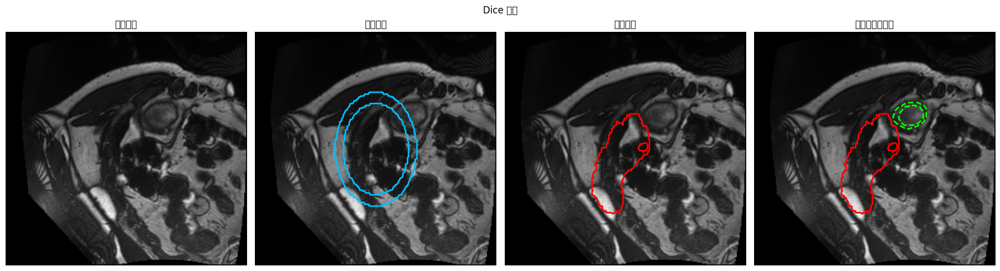
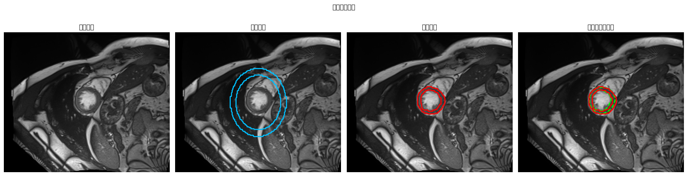

# ACDC Batch=200 实验报告

> 本文件由评估流程自动生成；若重复运行，会被新的实验结果覆盖。

## 实验概览

- 生成时间：2026-03-27 12:19:25
- 分支：`codex/acdc-server-run`
- 提交：`7780064e3e46a2722b6714c6a7ade96998d9d943`
- 运行名：`acdc_batch200_20260327_1110`
- 原始数据目录：`/mydisk/202b/fmw/projects/Resources`
- 预处理缓存目录：`/mydisk/202b/fmw/acdc_batch200_20260327_1110/processed/acdc_ring_144x208`
- 结果目录：`/mydisk/202b/fmw/acdc_batch200_20260327_1110/repo/results/acdc/acdc_batch200_20260327_1110`
- 训练命令：`python scripts/train_runner.py --dataset ACDC --raw-data-path /mydisk/202b/fmw/projects/Resources --processed-data-path /mydisk/202b/fmw/acdc_batch200_20260327_1110/processed/acdc_ring_144x208 --run-name acdc_batch200_20260327_1110 --epochs 200 --batch-size 200 --num-workers '0
'`
- 设备：`cuda:0`

## 训练配置

- epoch：200
- batch size：200
- 训练病人数：90
- 验证病人数：10
- 测试病人数：50
- 训练切片数：1584
- 验证切片数：198
- 测试切片数：972

## 预处理摘要

```json
{
  "target_size": [
    144,
    208
  ],
  "prior_radius": 35,
  "prior_thickness": 7,
  "subsets": {
    "training": {
      "patients": 100,
      "frames": 200,
      "total_slices": 1902,
      "empty_slices": 74,
      "non_ring_slices": 46,
      "kept_slices": 1782
    },
    "testing": {
      "patients": 50,
      "frames": 100,
      "total_slices": 1076,
      "empty_slices": 87,
      "non_ring_slices": 17,
      "kept_slices": 972
    }
  }
}
```

## 测试集指标

| 指标 | 数值 |
| --- | --- |
| Dice | 0.5362 +/- 0.2434 |
| HD95 | 20.4583 +/- 26.8237 |
| ASSD | 5.5707 +/- 6.4537 |
| 拓扑保持率 | 0.7953 |
| Jacobian folding 比率 | 0.1051 +/- 0.0268 |

## 可视化样例

下列四组样例分别对应 Dice 最好、中位、最差，以及固定随机种子的随机样本。

### Dice 最好

- 样本：`patient104_frame11_slice002`
- Dice：0.9124
- HD95：3.8670
- ASSD：1.4625
- GT Betti：`(1, 1)`
- Pred Betti：`(1, 2)`
- Folding Ratio：0.086872



### Dice 中位

- 样本：`patient148_frame10_slice003`
- Dice：0.6144
- HD95：4.6940
- ASSD：2.3277
- GT Betti：`(1, 1)`
- Pred Betti：`(1, 1)`
- Folding Ratio：0.097489



### Dice 最差

- 样本：`patient112_frame01_slice009`
- Dice：0.0000
- HD95：134.1567
- ASSD：48.8668
- GT Betti：`(1, 1)`
- Pred Betti：`(1, 1)`
- Folding Ratio：0.075137



### 固定随机样本

- 样本：`patient134_frame01_slice007`
- Dice：0.7597
- HD95：3.2318
- ASSD：1.2480
- GT Betti：`(1, 1)`
- Pred Betti：`(1, 1)`
- Folding Ratio：0.074302



## 结论

- 本报告同时给出分割精度、距离误差、结果拓扑与形变 folding 两条稳定性证据。
- 如果后续继续对积分器或先验形状做实验，应优先对比本报告中的 Dice/HD95/ASSD 与拓扑保持率是否同步变化。
