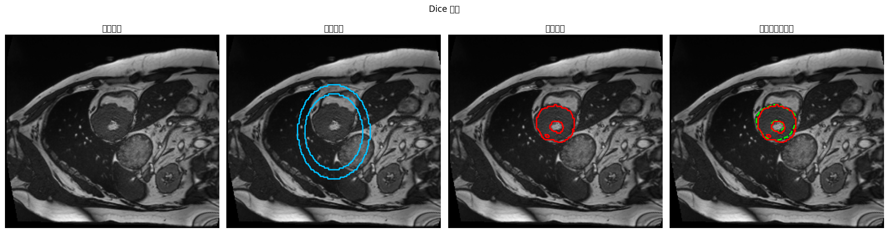
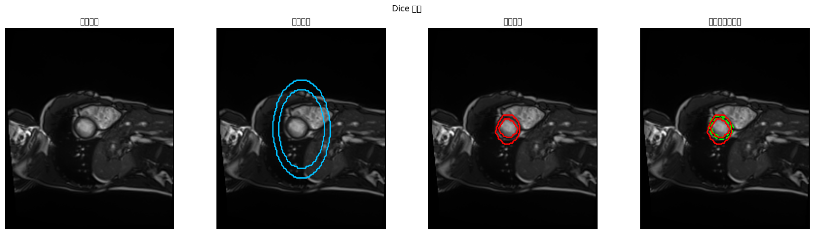
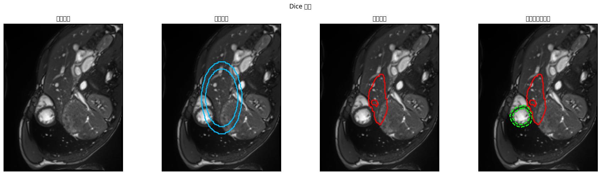
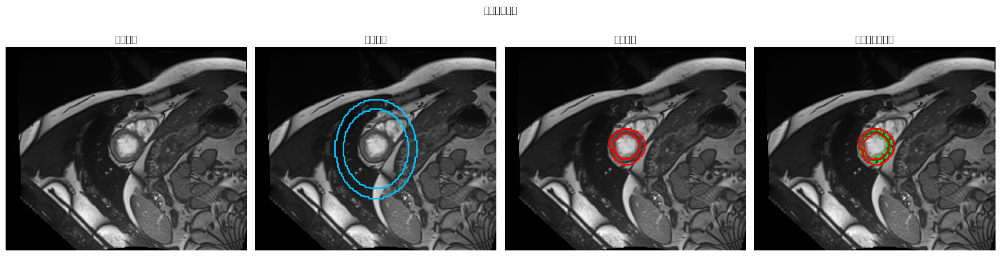

# ACDC Batch=200 实验报告

> 本文件由评估流程自动生成；若重复运行，会被新的实验结果覆盖。

## 实验概览

- 生成时间：2026-03-27 16:54:51
- 分支：`acdc_run_260126`
- 提交：`1ddef343e551b09b1912e487ffe46a5b98a52674`
- 运行名：`acdc_batch200_20260327_1600`
- 原始数据目录：`/mydisk/202b/fmw/projects/Resources`
- 预处理缓存目录：`/mydisk/202b/fmw/acdc_batch200_20260327_1600/processed/acdc_ring_144x208`
- 结果目录：`/mydisk/202b/fmw/acdc_batch200_20260327_1600/outputs/acdc_batch200_20260327_1600`
- 最佳模型：`/mydisk/202b/fmw/acdc_batch200_20260327_1600/outputs/acdc_batch200_20260327_1600/checkpoints/best.pt`
- 训练命令：`python /mydisk/202b/fmw/acdc_batch200_20260327_1600/repo/trainACDC.py --raw-data-path /mydisk/202b/fmw/projects/Resources --processed-data-path /mydisk/202b/fmw/acdc_batch200_20260327_1600/processed/acdc_ring_144x208 --output-root /mydisk/202b/fmw/acdc_batch200_20260327_1600/outputs --run-name acdc_batch200_20260327_1600 --epochs 200 --batch-size 200 --num-workers 0`
- 评估命令：`python /mydisk/202b/fmw/acdc_batch200_20260327_1600/repo/evaluate_results.py --raw-data-path /mydisk/202b/fmw/projects/Resources --processed-data-path /mydisk/202b/fmw/acdc_batch200_20260327_1600/processed/acdc_ring_144x208 --output-root /mydisk/202b/fmw/acdc_batch200_20260327_1600/outputs --run-name acdc_batch200_20260327_1600 --num-workers 0`
- 设备：`cuda:0`

## 数据划分与训练配置

- 数据划分策略：官方 `training/testing` 划分；仅在 `training` 内按病人切分训练集与验证集。
- 数据泄漏风险说明：训练、验证、测试之间不共享病人；不再使用随机切片混拆。
- epoch：200
- batch size：200
- 最佳 epoch：191
- 训练病人数：90
- 验证病人数：10
- 测试病人数：50
- 训练切片数：1584
- 验证切片数：198
- 测试切片数：972

## 预处理摘要

```json
{
  "target_size": [
    144,
    208
  ],
  "prior_radius": 35,
  "prior_thickness": 7,
  "subsets": {
    "training": {
      "patients": 100,
      "frames": 200,
      "total_slices": 1902,
      "empty_slices": 74,
      "non_ring_slices": 46,
      "kept_slices": 1782
    },
    "testing": {
      "patients": 50,
      "frames": 100,
      "total_slices": 1076,
      "empty_slices": 87,
      "non_ring_slices": 17,
      "kept_slices": 972
    }
  }
}
```

## 主结果表

| Dice ↑ | HD ↓ | Correct topology ↑ | Time per epoch [min] ↓ | # Parameters [x10^5] |
| --- | --- | --- | --- | --- |
| 0.5009 +/- 0.2322 | 29.2235 +/- 36.8031 | 86.42% | 0.16 | 7.09 |

## 补充指标

| 指标 | 数值 |
| --- | --- |
| HD95 | 23.8155 +/- 33.4740 |
| ASSD | 6.4822 +/- 7.9763 |
| Jacobian folding 比率 | 0.1308 +/- 0.0307 |

## 可视化样例

下列四组样例分别对应 Dice 最好、中位、最差，以及固定随机种子的随机样本。

### Dice 最好

- 样本：`patient105_frame10_slice003`
- Dice：0.9029
- HD：6.6383
- HD95：5.3520
- ASSD：1.7584
- GT Betti：`(1, 1)`
- Pred Betti：`(1, 2)`
- Folding Ratio：0.124624



### Dice 中位

- 样本：`patient126_frame01_slice011`
- Dice：0.5485
- HD：9.0616
- HD95：6.0670
- ASSD：1.4644
- GT Betti：`(1, 1)`
- Pred Betti：`(1, 1)`
- Folding Ratio：0.169705



### Dice 最差

- 样本：`patient109_frame01_slice006`
- Dice：0.0000
- HD：82.5024
- HD95：70.9309
- ASSD：28.7601
- GT Betti：`(1, 1)`
- Pred Betti：`(1, 1)`
- Folding Ratio：0.145466



### 固定随机样本

- 样本：`patient134_frame01_slice008`
- Dice：0.6872
- HD：5.2111
- HD95：4.0880
- ASSD：1.4677
- GT Betti：`(1, 1)`
- Pred Betti：`(1, 1)`
- Folding Ratio：0.130108



## 结论

- 主表按照图表口径给出 Dice、HD、拓扑保持率、单 epoch 耗时和参数量，便于与基线直接横向对比。
- 报告同时补充 HD95、ASSD 与 Jacobian folding 比率，帮助判断精度、边界误差与形变稳定性是否同步变化。
